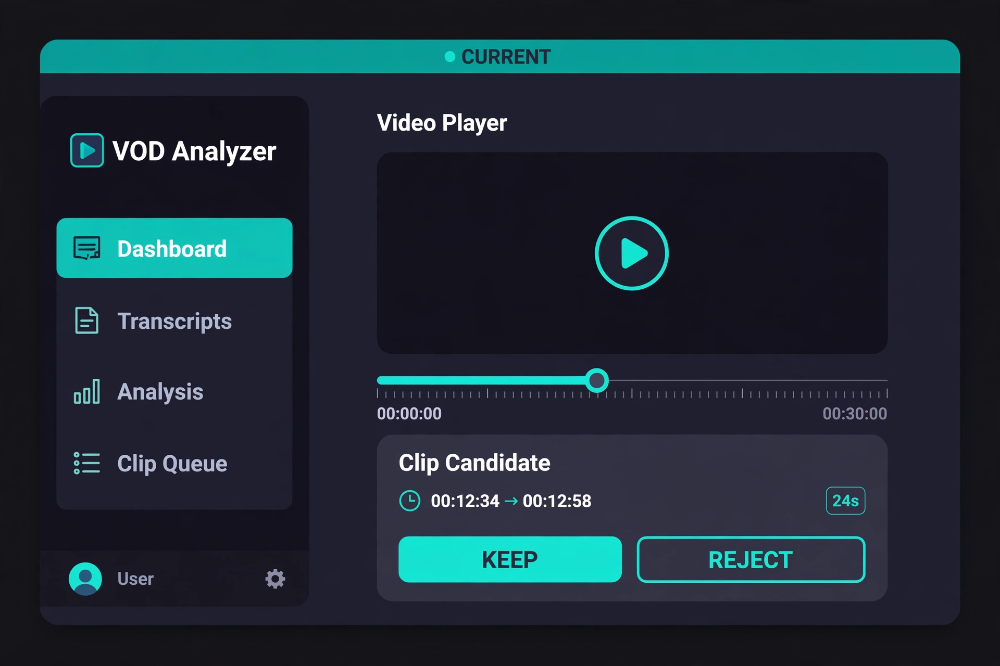
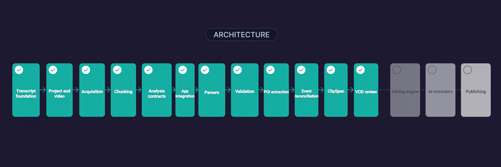
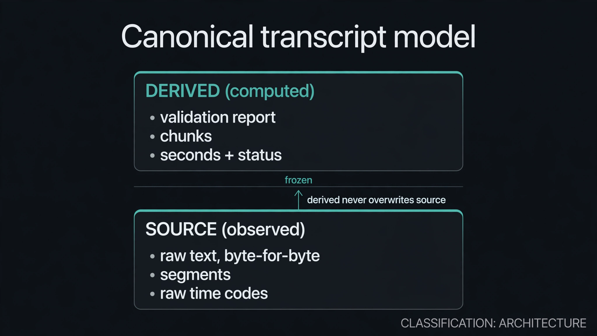
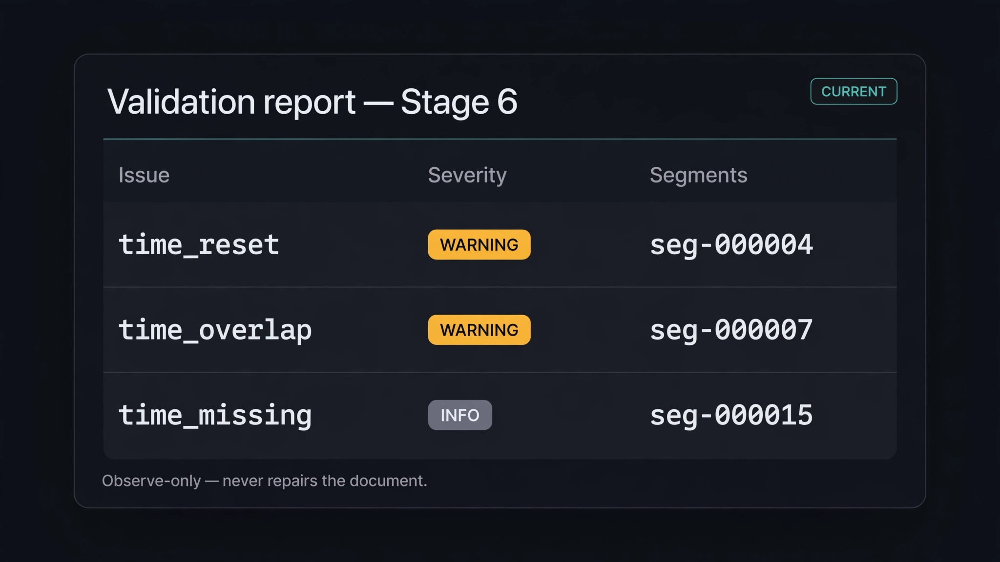
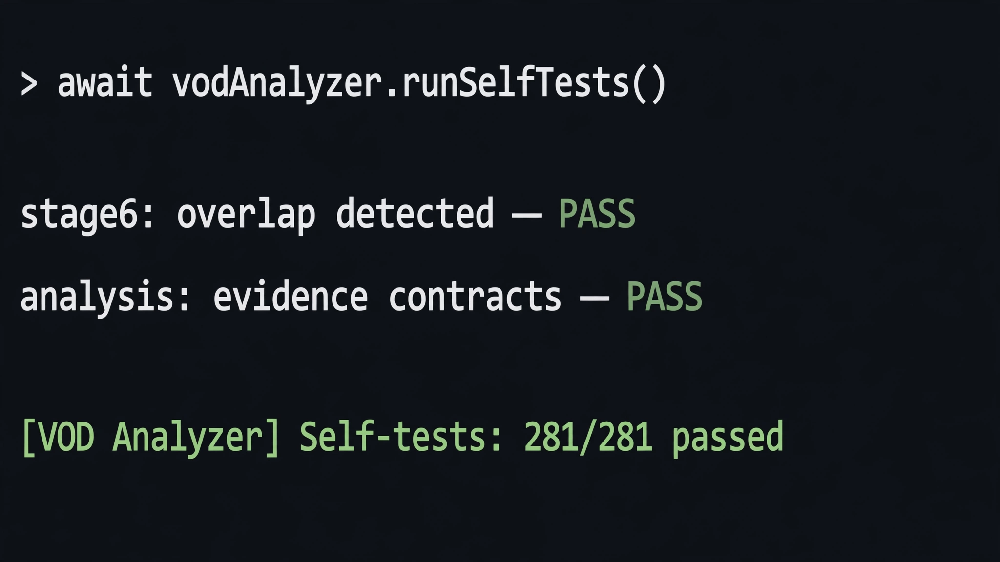
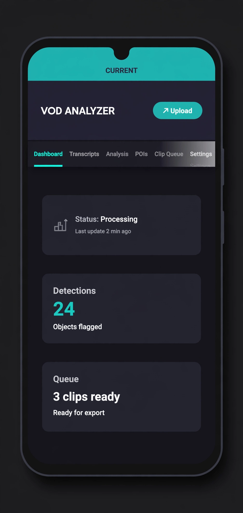
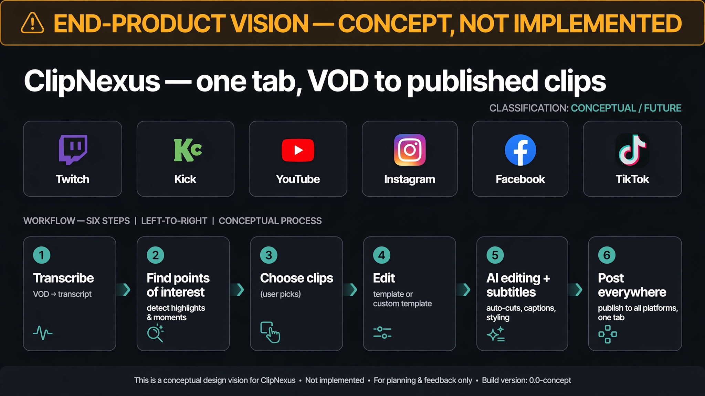

ClipNexus

Modular, provider-agnostic VOD transcript analysis and clip intelligence pipeline.

ClipNexus is being built as an evidence-first system for turning long-form VODs into structured, reviewable information that can eventually feed a short-form video editing workflow.

The project is designed around a strict separation between source data, derived analysis, clip specifications, and video editing.

«VOD → Transcript → Evidence → POIs → Events → ClipSpec → Editing»

The goal is not to have AI decide what content is “viral.”
The goal is to build a reliable pipeline that preserves evidence, uncertainty, provenance, and human control.

---

Current Status

Development stage: post–Stage 10 UI refinement — user-facing dashboard copy, corrected clip-candidate stat, and refined mobile navigation (sticky header + nav strip, bottom active indicator, scroll fade)

Stage| Status| Description
Stage 1| ✅ Complete| Frontend shell and application structure
Stage 1.5| ✅ Complete| Canonical transcript/project architecture
Stage 1.6| ✅ Complete| Project & video foundation
Stage 1.7| ✅ Complete| Architecture hardening and regression testing
Stage 2A| ✅ Complete| Provider/acquisition architecture
Stage 2B| ✅ Complete| Supadata YouTube transcript provider
Stage 2C| ✅ Complete| Transcript chunking and export workflow
Stage 3| ✅ Complete| Analysis contracts + extractor seam (no AI yet)
Stage 4| ✅ Complete| Application integration: validation checks, pipeline chunking, JSON export, analysis tab with deterministic extractor
Stage 5| ✅ Complete| Transcript format parsers: TXT, SRT, and VTT → canonical segments through the existing pipeline
Stage 6| ✅ Complete| Semantic temporal validation: deterministic end-before-start, ordering/reset, and overlap checks over the canonical transcript (observe-only, no repairs)
Stage 7| ✅ Complete| Provider-neutral POI extraction: canonical POI domain, evidence contract, extraction provider contract + normalization boundary, deterministic mock provider
Stage 8| ✅ Complete| Event reconciliation: canonical Event domain, deterministic grouping over observable relationships, provider-neutral reconciler contract + normalization boundary, deterministic mock reconciler
Stage 9| ✅ Complete| ClipSpec architecture: canonical ClipSpec domain (potential-clip specification, not a clip or a ranking), deterministic ids, event/POI reference validation, provider-neutral derivation contract + normalization boundary, deterministic mock deriver (no AI, no scoring)
Stage 10| ✅ Complete| Embedded VOD review + clip candidate selection: canonical ClipDecision domain (human KEEP/REJECT over ClipSpec ids), provider-neutral embedded-player controller + YouTube driver (readiness queueing, no external JS), Clip Queue review view, narrow YouTube-nocookie iframe security boundary (no AI, no ranking, no clip generation)
Future| ⏳ Planned| ClipNexus editing/rendering engine

The current application already has a functioning canonical transcript pipeline and a real YouTube transcript provider.

---

## Visual overview

Each visual below is labeled with what it represents: **CURRENT** (implemented behavior), **ARCHITECTURE** (how the system is structured), or **CONCEPTUAL / FUTURE** (direction, not built yet). Nothing here shows a feature that doesn't exist.

### What works today — CURRENT



Acquire (file upload or Supadata) → Parse → Validate → Chunk → Export & Analyze → provider-neutral POI extraction (canonical POI domain + deterministic mock provider; no AI extractor) → event reconciliation → ClipSpec derivation → the Clip Queue, where candidates are reviewed against the embedded player with seek, Keep, and Reject. AI editing and publishing remain planned.

### Roadmap: implemented vs. planned — ARCHITECTURE



Teal stages are implemented and tested, through Stage 10 (embedded VOD review + clip selection) and the UI refinement pass. Gray stages (editing engine, AI extractors, publishing) are planned and intentionally shown inactive.

### Canonical transcript model — ARCHITECTURE



Source-observed data stays separate from derived data. The document is frozen; derived layers never overwrite source evidence.

### Validation report — temporal checks (Stage 6) — CURRENT



The Stage 6 validator reports end-before-start, backward ordering (resets vs. local moves), and genuine overlap as observe-only warnings. It never repairs the document. (The image abbreviates the issue names as `time_*`; the real identifiers are `timestamp_reset`, `timestamp_overlap`, and `timestamp_missing`.)

### Self-test console — CURRENT



`await vodAnalyzer.runSelfTests()` runs 472 checks in the browser console with no network calls. No pytest, no CI — this is the real interface.

### Mobile navigation refinement — CURRENT



Illustrative mock of the refined mobile experience: the header and nav strip stay pinned while scrolling, the active tab is marked with a bottom indicator instead of the desktop side bar, and the strip's trailing edge fades to show it scrolls sideways. (Body cards are representative; the navigation behavior is what's implemented.)

### End-product vision — CONCEPTUAL / FUTURE



The long-term direction: one tab where a VOD from Twitch, Kick, YouTube, Instagram, Facebook, or TikTok is transcribed, points of interest are found, the user picks clips, chooses a template (or builds a custom one), AI performs the edit with subtitles, and finished videos post to every platform. **None of this is implemented.** It exists here so the architecture above can be judged against where it's heading.

---

What Is ClipNexus?

ClipNexus is intended to become a modular system for analyzing long-form video content.

Instead of tightly coupling transcript acquisition, AI analysis, and video editing together, ClipNexus treats each layer as a separate system with defined contracts.

                    ┌──────────────────┐
                    │       VOD        │
                    └────────┬─────────┘
                             │
                             ▼
                 ┌───────────────────────┐
                 │ Transcript Acquisition│
                 │   Provider Layer      │
                 └───────────┬───────────┘
                             │
                             ▼
                 ┌───────────────────────┐
                 │ TranscriptDocument    │
                 │ Canonical Data Model  │
                 └───────────┬───────────┘
                             │
                    ┌────────┴────────┐
                    ▼                 ▼
              Validation          Chunking
                    │                 │
                    └────────┬────────┘
                             ▼
                 ┌───────────────────────┐
                 │ Evidence / AI Analysis│
                 └───────────┬───────────┘
                             │
                             ▼
                 ┌───────────────────────┐
                 │        POIs           │
                 │ Points of Interest    │
                 └───────────┬───────────┘
                             │
                             ▼
                 ┌───────────────────────┐
                 │ Event Reconciliation  │
                 └───────────┬───────────┘
                             │
                             ▼
                 ┌───────────────────────┐
                 │       ClipSpec        │
                 └───────────┬───────────┘
                             │
                             ▼
                 ┌───────────────────────┐
                 │ Future Editing Engine │
                 └───────────┬───────────┘
                             │
                             ▼
                       Rendered Short

The important boundary is:

Analyzer
   │
   ▼
ClipSpec
   │
   ▼
Future Editing Engine

The editing engine should not need to understand how transcripts were acquired or how the analysis was performed.

---

Core Design Principles

1. Provider Agnostic

Transcript acquisition is isolated behind provider interfaces.

The rest of the application should not need to know whether a transcript came from:

- Supadata
- YouTube captions
- another API
- a future backend service
- an imported file
- a local processing pipeline

Provider-specific behavior belongs inside the provider adapter.

---

2. One Canonical Transcript Model

All transcript sources are normalized into a shared:

TranscriptDocument

This is the application's source of truth.

Provider responses, imported files, and future acquisition methods should flow through the same canonical model.

Provider/File
     │
     ▼
Parser / Adapter
     │
     ▼
TranscriptDocument
     │
     ├── Validation
     ├── Chunking
     ├── Analysis
     └── Export

No feature should create a competing transcript representation unless there is a clearly defined architectural reason.

---

3. Preserve Evidence

ClipNexus distinguishes between information that came directly from the source and information derived later.

Examples:

SOURCE
├── Original transcript text
├── Source timestamps
├── Speaker attribution
├── Provider
├── Language
└── Acquisition metadata

DERIVED
├── Normalized timestamps
├── Validation results
├── Chunks
├── POIs
├── Events
├── Analysis
└── ClipSpec

Derived information should never silently overwrite source evidence.

---

4. Preserve Uncertainty

Not every transcript has reliable timestamps or speaker attribution.

ClipNexus therefore tracks uncertainty instead of pretending that imperfect information is authoritative.

For example:

timestamp_reliability = LOW
speaker_attribution   = MEDIUM
transcript_quality    = MEDIUM

The system should preserve these limitations so downstream analysis can account for them.

---

5. AI Is an Analyzer, Not the Final Decision Maker

The future analysis layer is designed to:

- identify observable evidence
- describe events
- extract potential POIs
- preserve context
- identify missing information
- identify uncertainty
- produce structured data

It should not:

- invent dialogue
- invent context
- fabricate events
- assign unsupported meaning
- predict virality
- rank clips
- decide what the human must publish

The human remains the final editor and selector.

---

Transcript Pipeline

The current pipeline supports multiple transcript entry points.

YouTube URL
    │
    ▼
Video Resolver
    │
    ▼
Transcript Provider
    │
    ▼
Provider Adapter
    │
    ▼
TranscriptDocument

Or:

TXT / JSON / SRT / VTT
        │
        ▼
     Parser
        │
        ▼
TranscriptDocument

All paths converge on the same canonical document.

---

Current Provider

Supadata

Supadata is currently the first production transcript provider.

The provider layer supports:

- YouTube transcript acquisition
- native captions
- generated/automatic captions
- language selection
- runtime API-key entry
- provider-specific error normalization
- acquisition status tracking
- provenance recording

API credentials are held in memory and are not intended to be persisted in browser storage.

Provider-specific response data is normalized at the adapter boundary and does not leak into the canonical application model.

---

Transcript Processing

The transcript pipeline is designed to support:

- parsing
- validation
- timestamp normalization
- speaker metadata
- deterministic segment IDs
- chunking
- transcript preview
- transcript export
- chunk export
- provenance
- processing metadata

Chunking is treated as derived transcript data, not as a second transcript model.

TranscriptDocument
       │
       ▼
   Segments
       │
       ▼
    Chunker
       │
       ▼
     Chunks

The original transcript remains intact.

---

Analysis Pipeline

The planned analysis layer will consume the canonical transcript rather than raw provider responses.

TranscriptDocument
        │
        ▼
   Evidence Layer
        │
        ▼
     Analysis
        │
        ▼
      POIs
        │
        ▼
 Event Reconciliation
        │
        ▼
    ClipSpec

This separation allows the analysis system to evolve independently from transcript acquisition.

---

Points of Interest

A POI represents an observable section of source material that may deserve further review. POIs are canonical, immutable, deeply frozen data — derived from a transcript, never a replacement for it.

The canonical POI shape (Stage 7, `js/analysis/pois.js`):

- `schemaVersion`, deterministic `id` (`poi-000000`, …), `transcriptId`
- `type`: `highlight` | `question` | `speaker_change` | `other` (providers cannot invent categories)
- `label`: human-readable, non-empty
- `startSeconds` / `endSeconds`: finite numbers ≥ 0, or `null` (null = located by evidence, not by time). End without start is rejected; reversed ranges are rejected, never repaired; zero-length ranges are valid
- `sourceRef: { transcriptId, segmentIds }`: every segment id must exist in the cited transcript — segment ids, not indexes, are the durable evidence identity
- `provenance: { providerId, providerName, extractedAt, candidateIndex, providerRef? }`

Extraction is provider-neutral (`js/analysis/poi-providers/`), mirroring the transcript provider architecture:

- A provider receives only a frozen, curated input (`transcriptId` + segment views with canonical temporal pairs) — never the `TranscriptDocument` internals
- It returns candidates (claims, not POIs) or a normalized failure
- The normalization boundary validates every candidate against the authoritative transcript, drops all provider-specific fields, assigns deterministic ids, and stamps provenance from the provider descriptor — never from the response
- Failures are normalized to fixed codes (`PROVIDER_ERROR`, `MALFORMED_RESPONSE`, `NOT_IMPLEMENTED`, `UNKNOWN_ERROR`) with `retryable`, `providerId`, and developer-only `detail`; they never propagate as raw exceptions or partial POI lists
- A deterministic mock provider (`?` → question, `!` → highlight) proves the boundary with no network, no AI, and no randomness
- `withPois(project, pois)` attaches validated POIs to a project through the established immutable update path

POIs are candidates for human review, not automatic publishing decisions. Explicitly not in Stage 7: AI/LLM extraction, real vendor integrations, event extraction/reconciliation, automatic clip selection or ranking, "best moment" scoring, ClipSpec, clip editing, and video downloading/processing.

---

Events

An Event is a reconciled moment built from canonical POIs — derived interpretation, never a replacement for POIs or transcript evidence. Events are canonical, immutable, deeply frozen data. The traceability chain stays:

Event → POI id(s) → POI.sourceRef → segment id(s) → TranscriptDocument

The canonical Event shape (Stage 8, `js/analysis/events.js`):

- `schemaVersion`, deterministic `id` (`event-000000`, …), `transcriptId`
- `type`: `single` | `grouped` (what the reconciler observably did — one POI standing alone, or several joined by a deterministic rule; reconcilers cannot invent categories)
- `label`: human-readable, non-empty
- `startSeconds` / `endSeconds`: finite numbers ≥ 0, or `null` (null = located by POI evidence, not by time). End without start is rejected; reversed ranges are rejected, never repaired; zero-length ranges are valid
- `poiIds`: POI ids only — never copied POIs, never transcript text, never array indexes. Every id must resolve to a canonical POI in the reconciliation's transcript; missing references, wrong-transcript POIs, and duplicates are rejected, never silently dropped or repaired
- `derivation: { reconcilerId, reconcilerName, reconciledAt, candidateIndex, reconcilerRef?, rule }` — `rule` names the deterministic relationship that formed the event (`none` for single events, `temporal_overlap` / `temporal_adjacency` / `shared_evidence`, or `multiple` when several distinct rules fired)

Reconciliation is provider-neutral (`js/analysis/event-reconcilers/`), mirroring the POI provider architecture:

- A reconciler receives only a frozen, curated input (`transcriptId` + POI views with canonical ids, types, temporal anchors, and evidence segment ids) — never mutable Project internals, DOM state, or credentials
- It returns candidate Events (claims, not Events) or a normalized failure
- The normalization boundary resolves every POI reference against the canonical POI set, drops all reconciler-specific fields, assigns deterministic ids, and stamps derivation from the reconciler descriptor — never from the response
- Failures are normalized to fixed codes (`PROVIDER_ERROR`, `MALFORMED_RESPONSE`, `NOT_IMPLEMENTED`, `UNKNOWN_ERROR`) with `retryable`, `reconcilerId`, and developer-only `detail`; they never propagate as raw exceptions or partial Event lists
- Grouping uses only deterministic, observable relationships — temporal overlap (strictly larger than a point), temporal adjacency (exact touching; "close" is not adjacent), and shared evidence. No heuristics, no semantic guessing, no scoring
- A grouped Event's temporals are derived by an explicit rule: start = earliest contributing POI start, end = latest contributing POI end (null when no POI offers one). Single events inherit their POI's temporals exactly. Timestamps are never invented
- A deterministic mock reconciler proves the boundary with no network, no AI, no randomness, and no heuristics
- `withEvents(project, events)` attaches validated Events to a project through the established immutable update path

Explicitly not in Stage 8: AI/LLM extraction or reconciliation, embeddings, vector search, virality/scoring/ranking, "best moment" selection, ClipSpec, clip editing, rendering, playback, timestamp repair, and transcript rewriting.

---

ClipSpec

A ClipSpec is a structured specification describing a POTENTIAL clip — what a clip derived from a validated Event IS, never a judgment of whether it is GOOD. It is not a video clip, not a ranking, and not a scoring system. ClipSpecs are canonical, immutable, deeply frozen data. The traceability chain stays:

ClipSpec → Event → POI id(s) → POI.sourceRef → segment id(s) → TranscriptDocument

The canonical ClipSpec shape (Stage 9, `js/analysis/clip-spec.js`):

- `schemaVersion`, deterministic `id` (`clip-000000`, …), `transcriptId`, `eventId`
- `startSeconds` / `endSeconds`: finite numbers ≥ 0, or `null` (null = located by Event evidence, not by time). Explicit start/end semantics: start ≤ end. End without start is rejected; reversed ranges are rejected, never repaired; zero-length ranges are valid; missing timestamps stay unknown, never zero
- `poiIds`: source POI ids preserved from the describing Event — never copied POIs, never transcript text, never array indexes. Every id must be a member of the Event's `poiIds`; invented or missing references are rejected, never silently dropped or repaired
- `derivation: { deriverId, deriverName, derivedAt, candidateIndex, deriverRef? }` — stamped from the deriver descriptor, never from the deriver's response

Derivation is provider-neutral (`js/analysis/clip-spec-derivers/`), mirroring the POI and Event architectures:

- A deriver receives only a frozen, curated input (`transcriptId` + Event views with canonical ids, types, temporal boundaries, and contributing POI ids) — never mutable Project internals, DOM state, or credentials
- It returns candidate ClipSpecs (claims, not ClipSpecs) or a normalized failure
- The normalization boundary resolves every `eventId` against the canonical Event set, verifies every `poiId` is preserved from that Event, drops all deriver-specific fields (scores, rankings, model output), assigns deterministic ids, and stamps derivation from the deriver descriptor
- Failures are normalized to fixed codes (`PROVIDER_ERROR`, `MALFORMED_RESPONSE`, `NOT_IMPLEMENTED`, `UNKNOWN_ERROR`) with `retryable`, `deriverId`, and developer-only `detail`; they never propagate as raw exceptions or partial ClipSpec lists
- The deterministic mock deriver describes exactly the Event it was derived from: it inherits the Event's temporals unchanged and preserves its POI ids. No ranking, no scoring, no heuristics, no semantic guessing — no timestamps are ever invented
- `withClipSpecs(project, clipSpecs)` attaches validated ClipSpecs to a project through the established immutable update path

Explicitly not in Stage 9: AI clip selection, ranking, scoring, virality detection, semantic quality judgments, video cutting, FFmpeg, export/rendering, timeline editing UI, automatic clip downloading, LLM calls, and network APIs. Stage 9 is architecture and contracts only.

This is a deliberate architectural boundary: a future editing engine will consume ClipSpec objects without needing to understand the internal analysis pipeline.

---

ClipDecision

A ClipDecision is a canonical record of ONE human judgment about ONE ClipSpec candidate: `"keep"` (the user selected it) or `"reject"` (the user discarded it). The absence of a decision means "unreviewed" — there is no third stored value. This is the Stage 10 architectural rule:

ClipSpec = "the analysis system identified this candidate."
ClipDecision = "the human reviewed this candidate and chose KEEP or REJECT."

The concepts are never collapsed. ClipSpecs stay immutable analysis artifacts; decisions live in a separate Project-level layer (`js/analysis/clip-decisions.js`) that references ClipSpec ids only and never copies or mutates the underlying evidence.

The canonical ClipDecision shape (Stage 10):

- `schemaVersion`, `clipSpecId`, `decision` (`"keep"` / `"reject"`), `decidedAt` (ISO-8601)
- Unknown ClipSpec ids are rejected, never stored; invalid decision values are rejected; every object is deeply frozen

Project integration follows the established immutable pattern:

- `withClipDecisions(project, decisions)` — bulk attach, validated against the project's ClipSpec ids (duplicates collapse deterministically)
- `setClipDecision(project, clipSpecId, decision)` — record one decision; KEEP ↔ REJECT transitions replace the earlier record
- `clearClipDecision(project, clipSpecId)` — reset one candidate to unreviewed
- `getKeptClipSpecs(project)` — the kept ClipSpecs in canonical `project.clipSpecs` order: the deterministic input future clip-generation stages will consume

Explicitly not in Stage 10: AI/LLM analysis, new POI or Event extraction, ranking, scoring, virality prediction, automatic candidate selection, automatic KEEP/REJECT, clip generation, video cutting, FFmpeg, transcoding, rendering, downloading, social publishing, automatic end-of-clip stopping, transcript/video synchronization correction, or invented timestamp correction.

---

Embedded VOD review

Stage 10 adds the first real human-review workflow: the Clip Queue view (`js/ui/clips.js`) shows an embedded VOD player above the ClipSpec candidate list. Clicking a candidate seeks the player to its `startSeconds`; the user watches the actual moment and marks it KEEP or REJECT. Analysis produces candidates; the human remains the final selector.

Player architecture (`js/video/player/`), provider-neutral by design:

- `controller.js` — the provider-neutral controller contract: create for one canonical video identity, `seek(seconds)`, `destroy()`. The controller is a live object (owns the iframe, the readiness handshake, and the seek queue) and never enters the immutable Project; the application coordinator (`js/app.js`) owns it
- `drivers/youtube.js` — the YouTube driver: pure functions mapping a validated canonical identity to a privacy-enhanced embed (`https://www.youtube-nocookie.com`) and to the YouTube IFrame Player postMessage protocol. The YouTube JS API script is deliberately not loaded
- Readiness is mandatory: seeks requested before the player signals ready are queued in order and executed once ready — a seek is never silently lost
- A valid `startPosition` URL hint is honored once per video; no hint is ever invented
- No usable video identity → no iframe; the controller is recreated cleanly when the project/video changes and destroyed when leaving the Clip Queue

Security boundary (deliberately revised in Stage 10 — the previous "no iframe" invariant is replaced, not bypassed):

- CSP gains exactly one narrow addition: `frame-src https://www.youtube-nocookie.com`. No arbitrary frame sources, scripts, media sources, or external domains
- The iframe source is built only from a validated canonical YouTube identity and must pass a strict allowlist (`isExpectedEmbedUrl`) as defense in depth — arbitrary user URLs can never become an iframe source
- Security tests verify the new boundary: the Clip Queue may contain only the intended player iframe, non-player views remain iframe-free, malformed identities create no player, and teardown removes the iframe cleanly

Alignment honesty: project time alignment is still `unverified`, and Stage 10 treats that honestly — candidate timestamps are transcript times, assumed but not proven to match video time. No offset is applied and none is invented; a `null` start timestamp disables seeking with a plain explanation, and a `null` end timestamp still allows seeking to the start. The user's watch-and-judge step is itself the verification loop.

---

Future ClipNexus Editing Engine

Video editing is intentionally separated from the current transcript system.

The long-term goal is to allow ClipNexus to eventually handle tasks such as:

- source video retrieval
- clip trimming
- vertical formatting
- captions
- subtitle styling
- overlays
- audio processing
- intro/outro elements
- automated rendering
- export for Shorts/TikTok/Reels

These capabilities are not part of the current transcript architecture.

The current priority is building a reliable information pipeline before adding video processing complexity.

---

Architecture

Current high-level structure:

Application
│
├── UI
│
├── Core
│   ├── Project
│   ├── State
│   └── Development Tools
│
├── Transcript
│   ├── Model
│   ├── Parsers
│   ├── Pipeline
│   ├── Validation
│   ├── Chunking
│   ├── Formats
│   └── Providers
│       ├── Acquisition
│       ├── Credentials
│       └── Adapters
│
├── Analysis
│   └── Deterministic extractor seam (Stages 3/4)
│
├── POIs
│   └── Canonical domain + provider-neutral extraction (Stage 7)
│
├── Events
│   └── Canonical domain + provider-neutral reconciliation (Stage 8)
│
├── ClipSpecs
│   └── Canonical domain + provider-neutral derivation (Stage 9)
│
└── Clips
    └── Future Editor

The architecture is intentionally modular so individual systems can be replaced without rebuilding the entire application.

---

Testing

ClipNexus uses an internal self-test/development test system to protect architectural contracts.

The self-test suite currently has:

469 / 469 tests passing

The test suite covers areas including:

- transcript model behavior
- project state
- parsing
- acquisition
- provider behavior
- error normalization
- stale acquisition attempts
- provenance
- immutability
- security boundaries
- regression behavior

Future features should extend the existing tests rather than bypassing them.

---

Security & Privacy

The application follows a minimal-credential architecture.

For the current Supadata integration:

- API keys are entered at runtime
- credentials are kept in memory
- credentials are not intentionally persisted in localStorage
- provider responses are normalized before entering application state
- provider-specific secrets should not appear in transcript exports
- provider credentials should not be included in logs or debugging output
- external network access is limited to the required provider endpoint

A shared/public deployment would require additional backend security architecture before exposing provider credentials through a common frontend.

---

Technology

Current frontend architecture:

- Vanilla HTML
- CSS
- JavaScript ES modules
- Browser-based application
- No frontend framework dependency

The architecture intentionally favors small, replaceable modules over a large framework-specific application structure.

Future backend and editing infrastructure may use different technologies where appropriate.

---

Development Philosophy

ClipNexus is being built incrementally.

The project does not attempt to build the entire AI clipping platform at once.

Each stage establishes contracts that later stages can build upon.

FOUNDATION
    │
    ├── Project model
    ├── Transcript model
    ├── Validation
    └── Provider architecture
             │
             ▼
DATA PIPELINE
    │
    ├── Acquisition
    ├── Parsing
    ├── Chunking
    └── Export
             │
             ▼
INTELLIGENCE
    │
    ├── Evidence analysis
    ├── POIs
    └── Event reconciliation
             │
             ▼
CLIP DEFINITION
    │
    └── ClipSpec
             │
             ▼
MEDIA
    │
    └── Future editing engine

The rule is simple:

«Build the data contracts before building the automation that depends on them.»

---

Current Limitations

The project is still under active development.

Current/future limitations include:

- additional transcript parsers are still being developed
- some provider integrations are not implemented
- "youtube-transcript-api" requires backend infrastructure
- browser-based provider access is primarily intended for individual use
- long VODs may exceed provider/request time limits
- transcript quality depends on the source/provider
- timestamps may be incomplete or unreliable
- speaker attribution may be unavailable
- AI analysis has not yet been integrated into the application pipeline
- AI POI extraction is not implemented (only the provider-neutral contract + deterministic mock provider exist)
- event reconciliation is not yet implemented
- ClipSpec is not yet implemented
- video editing/rendering is not yet implemented

---

Roadmap

Phase 1 — Foundation

- [x] Frontend shell
- [x] Project model
- [x] Canonical transcript model
- [x] Validation architecture
- [x] Development test infrastructure

Phase 2 — Transcript Infrastructure

- [x] Provider architecture
- [x] Acquisition state management
- [x] Supadata provider
- [x] Provider error normalization
- [x] Provenance tracking
- [x] Transcript chunking
- [x] Transcript export
- [x] Chunk export
- [x] Additional transcript formats (TXT, SRT, VTT, JSON)
- [ ] Additional providers

Phase 3 — Evidence Analysis

- [x] Evidence model
- [x] Analysis contracts
- [ ] Context extraction
- [ ] Source limitation reporting
- [ ] Structured AI analysis

Phase 4 — Clip Intelligence

- [x] POI extraction architecture (provider-neutral contract + deterministic mock provider; no AI extractor)
- [x] Event reconciliation (canonical Event domain + provider-neutral reconciler contract + deterministic mock reconciler; no ranking, no scoring)
- [ ] Context relationships
- [ ] Media dependency tracking

Phase 5 — Clip Specification

- [x] ClipSpec schema (canonical ClipSpec domain + deterministic ids; specification only, not a clip or a ranking)
- [x] Clip boundaries (explicit start/end semantics, null/unknown preserved, malformed rejected — never repaired)
- [x] Evidence references (eventId + preserved POI ids; full ClipSpec → Event → POI → segment chain)
- [ ] Editing instructions
- [ ] Editor handoff contract

Phase 6 — Human Review

- [x] ClipDecision domain (canonical human KEEP/REJECT layer over ClipSpec ids; unreviewed = no record; ClipSpecs untouched)
- [x] Immutable decision operations (withClipDecisions / setClipDecision / clearClipDecision / getKeptClipSpecs on the Project)
- [x] Provider-neutral embedded-player controller (readiness queueing; live objects never enter the Project)
- [x] YouTube player driver (privacy-enhanced nocookie embed, postMessage seeking, no external JS)
- [x] Clip Queue review view (embedded player + candidate cards + KEEP/REJECT + honest alignment status)
- [x] Narrow iframe security boundary (CSP frame-src for youtube-nocookie.com only; strict embed-URL allowlist)

Future — ClipNexus Editing Engine

- [ ] Video ingestion
- [ ] Clip rendering
- [ ] Captions
- [ ] Vertical formatting
- [ ] Audio processing
- [ ] Overlays
- [ ] Automated export

---

Repository Status

ClipNexus is an active development project.

Architecture and contracts are expected to evolve as each stage is implemented, but previously established contracts should remain backward-compatible whenever practical.

Changes that affect architectural boundaries should be documented and tested.

---

Project Direction

ClipNexus is ultimately intended to connect content analysis with deterministic media production without turning the system into an opaque black box.

The long-term architecture is:

                 CLIPNEXUS

       ┌─────────────────────────┐
       │       SOURCE VOD        │
       └────────────┬────────────┘
                    │
                    ▼
       ┌─────────────────────────┐
       │   TRANSCRIPT PIPELINE   │
       └────────────┬────────────┘
                    │
                    ▼
       ┌─────────────────────────┐
       │    EVIDENCE ANALYSIS    │
       └────────────┬────────────┘
                    │
                    ▼
       ┌─────────────────────────┐
       │       POI / EVENTS      │
       └────────────┬────────────┘
                    │
                    ▼
       ┌─────────────────────────┐
       │        ClipSpec         │
       └────────────┬────────────┘
                    │
                    ▼
       ┌─────────────────────────┐
       │   FUTURE VIDEO ENGINE   │
       └────────────┬────────────┘
                    │
                    ▼
              SHORT-FORM VIDEO

ClipNexus is being built one contract at a time.t`, `applyVideoIdentity`) returns a **new** project.
- Lifecycle: no project → project created → video identified → transcript attached. A transcript can be uploaded before or after a URL is entered.
- Entering the **same** video again (any URL form) never creates a new project or drops the transcript. If the URL has a new time value, only `video.startPosition` changes. A URL with no time value leaves the existing hint alone.
- Entering a **different** video starts a new project, because the old transcript belonged to the other video. If the current project has a transcript, an inline confirmation (**Cancel** / **Replace Project**) appears first. Cancel leaves the current project exactly as it was, as the same object. Transcripts are never merged or carried over to another video.
- The decision is pure. `applyVideoIdentity()` returns a plan `{project, outcome, requiresConfirmation}`, and `finalizeVideoChange(current, plan, {confirmed})` picks what to keep. The coordinator only shows the prompt and stores the result.

### Time alignment

`project.alignment` answers one question: do transcript timestamps correspond to positions on this video's timeline, and with what offset?

| Status | Meaning | Used now? |
|---|---|---|
| `unverified` | The relationship has **not** been established | Yes — the only status through Stage 1.7 |
| `assumed` | A documented basis exists (recorded in `method`) but nothing independently checked it | Future |
| `verified` | Defined evidence (in `evidence`) establishes the relationship; `verifiedAt` is set | Future |

- `method: null` and `evidence: []` stay empty until a later stage defines what methods and evidence records are.
- Having timestamps, a plausible duration, or a URL `?t=` is **not** evidence of alignment: data existing is not the same as data proving alignment.
- `offsetSeconds: null` means unknown, not zero.

### Transcript ↔ video relationship

The transcript and its segments contain **no** video data. The project holds the link. A future POI will trace back through:

```
project.id → project.video.identity → project.transcript.id
→ segment ids → segment.start / segment.end (raw + seconds)
→ alignment → player.seekTo(seconds)
```

Stage 1.5 timestamps (`{ raw, seconds, status }`) are the only timestamp representation, and no second "video time" format was added.

## Video model (Stage 1.6)

Defined in `js/video/video-model.js`. **Identity** and **metadata** are kept strictly apart:

```js
Video {
  schemaVersion: 1,
  identity: {                     // WHICH video, known locally from the URL
    platform: "youtube",
    videoId: "dQw4w9WgXcQ",
    canonicalUrl: "https://www.youtube.com/watch?v=dQw4w9WgXcQ",
    url: "https://youtu.be/dQw4w9WgXcQ?t=5"   // exactly as entered (source evidence)
  },
  metadata: {                     // WHAT the video is like, filled in only by a future provider
    title: null, thumbnailUrl: null, durationSeconds: null,
    status: "unknown",            // unknown | loading | loaded | unavailable | failed
    provider: null, retrievedAt: null
  },
  startPosition: {                // optional HINT from the URL, or null. NOT identity.
    raw: "1m20s",                 // exact text from the URL (source)
    seconds: 80,                  // derived; null unless status is "parsed"
    status: "parsed",             // parsed | malformed | ambiguous  (Stage 1.5 timestamp statuses)
    source: "url",
    sourceUrl: "https://youtu.be/dQw4w9WgXcQ?t=1m20s",   // exact URL the hint came from
    verified: false               // never checked against the video
  }
}
```

`startPosition` reuses the Stage 1.5 timestamp shape `{raw, seconds, status}` (`createTimestamp`), so there is no second timestamp system. `identity.url` stays the URL that first identified the video. When the same video is re-entered with a new time, only `startPosition` (and its `sourceUrl`) changes.

`null` means "not acquired", not "empty". "Not loaded" in the UI is display text only and is never stored.

## URL resolver (Stage 1.6)

`js/video/video-resolver.js` exports `resolveVideoUrl(input)`. It is pure: no network, no DOM, and it never throws on bad input.

```js
{ success: true,  video: { platform, videoId, canonicalUrl, url }, startPosition: {...} | null }
{ success: false, error: { code, message, detail } }
```

Steps: trim → length/whitespace check → `new URL()` (`https://` assumed if no scheme is given) → only `http:`/`https:` allowed → no embedded credentials → platform adapter by hostname → video ID extraction and validation → canonical URL.

Error codes: `empty_url`, `url_too_long`, `malformed_url`, `unsupported_protocol`, `unsupported_platform`, `missing_video_id`, `invalid_video_id`.

### Supported platform: YouTube

`js/video/platforms/youtube.js` handles `youtube.com`, `www.`, `m.`, and `music.youtube.com` (`/watch?v=`, `/embed/`, `/shorts/`, `/live/`, `/v/`), `youtu.be/ID`, and `youtube-nocookie.com/embed/`. The ID must be 11 characters of `[A-Za-z0-9_-]`. Parameters that don't change identity (`si`, `list`, `feature`) are ignored.

Start-position hint: `t` (query or `#t=` fragment) and embed `start` accept `120`, `120s`, `1m20s`, and `1h2m3s` (units in h→m→s order). Anything else (`abc`, `1m20`, `1.5`, `-5`, empty, out-of-range) gives `status: "malformed"` with `seconds: null`. Conflicting values (`t=10&t=20`) give `status: "ambiguous"` with `seconds: null`. A bad time value never fails URL resolution and is never turned into a guessed position. The canonical URL never includes it. Channel, playlist, and search pages fail with `missing_video_id`. Look-alike hosts such as `youtube.com.evil.example` are rejected.

### Adding a platform later

Create `js/video/platforms/<name>.js` exporting `platformId`, `label`, `matchesHost(hostname)`, `extractVideoId(url)`, `buildCanonicalUrl(id)`, and optionally `extractStartPosition(url)`, then add it to `platformAdapters` in the resolver. The project model doesn't change. Twitch and other platforms are **not** implemented.

## Transcript acquisition (Stage 2A)

Stage 2A added the **architecture** for getting transcripts from interchangeable providers. Stage 2B plugs the first real provider (Supadata) into it. The rest of the pipeline is unchanged:

```
Video URL → Video Identity → Provider Selection → Provider Adapter
    → Normalized AcquisitionResult → TranscriptDocument → Parser → Validator
```

```
normalized VIDEO (project.video, Stage 1.6/1.7)
      ↓
TRANSCRIPT PROVIDER MANAGER   js/transcript/providers/manager.js
      ↓  one attempt, one provider — the one the user chose
┌──────────────┬────────────────────────┬──────────────┐
│ supadata     │ youtube-transcript-api │ future …     │   adapters/*.js
└──────────────┴────────────────────────┴──────────────┘
      ↓  normalizeAdapterResponse()  (provider boundary)
ACQUISITION RESULT  → provenance → shared pipeline (parser → validator) → canonical TranscriptDocument
```

### Provider abstraction

Each adapter (`js/transcript/providers/adapters/<name>.js`) exports a `provider` built with `defineProvider()`:

```js
{
  id: "supadata", name: "Supadata", description: "…",
  status: "available" | "not_implemented",
  enabled: true,                          // false = listed but cannot be selected
  capabilities: {
    platforms: ["youtube"],               // omitted flags are false — nothing assumed
    nativeCaptions: true, generatedTranscript: true, languageSelection: true
  },
  getTranscript(video, options) → Promise<AdapterResponse>
}
```

- `video` is `{ platform, videoId, canonicalUrl }` (frozen), taken from the resolved project video. Adapters never receive the raw user URL or the start hint, and they never resolve URLs themselves.
- `options` is `{ language: string | null, method: "any" | "native" | "generated" }`. `language: null` means "provider default". English is never assumed.
- An adapter returns `{ success: true, transcript: { rawText, format }, source: { method, language, sourceId } }` or `{ success: false, error: { code, detail } }`. `rawText` must be the transcript text exactly as delivered, in a format the parser registry supports (`txt`, `srt`, `vtt`, `json`). Everything else an adapter returns is dropped at the boundary.

Built-in adapters:
- `supadata`: **real** (`status: "available"`). See [Supadata provider](#supadata-provider-stage-2b).
- `youtube-transcript-api`: **placeholder** (`status: "not_implemented"`). It is a Python library, so it can't run in the browser, and using it needs a user-run helper or a backend. It returns `NOT_IMPLEMENTED` and makes no requests.

The UI shows a status for display only, derived from registry data: **Available**, **Needs API key** (an available provider that declares a `credential` but has none entered yet), **Not implemented**, or **Disabled**. "Registered" never means "usable". `adapters/mock.js` holds deterministic fakes used by the self-tests. It is never registered by default.

### Provider registry

`js/transcript/providers/registry.js` → `createProviderRegistry()`. The app's instance is in `default-providers.js`.

- `register(provider)`: invalid or duplicate providers throw (a programming error).
- `get(id)`: `{ success, provider }`, or a controlled `PROVIDER_NOT_FOUND` error.
- `getSelectable(id)`: like `get`, but a disabled provider gives `PROVIDER_DISABLED`.
- `list()` / `listSelectable()`: frozen data-only descriptors (no functions). The UI builds its menus from these and names no provider itself.

Adding a provider means writing one adapter file and adding it to `default-providers.js`. No UI or coordinator change is needed.

### Acquisition result contract

`acquireTranscript({ registry, providerId, video, options, timeoutMs })` always resolves (it never throws) to one frozen shape:

```js
// success
{ success: true,
  source: { providerId, providerName, method, generated, language,
            requestedLanguage, requestedMethod, retrievedAt, sourceId,
            video: { platform, videoId } },
  payload: { rawText, format } }

// failure
{ success: false,
  error: { code, message, retryable, providerId, detail } }
```

- `providerId`/`providerName` come from the registry, not the response, so an adapter cannot misattribute a transcript.
- `retrievedAt` is the time the app received the response.
- Request checks run **before** the adapter is called: provider exists and is enabled, a video is present, the platform is supported, the language code is valid, and the requested language/method is within the provider's capabilities.
- An adapter that throws gives `PROVIDER_ERROR`. One that doesn't answer within `timeoutMs` (default 30 s) gives `PROVIDER_TIMEOUT`.
- Applying a result is a separate pure step, `applyAcquisitionToProject(project, result, buildAcquiredTranscript)`. On failure it returns the **same project object**. A success for a different video than the project's is rejected.

### Error vocabulary

`js/transcript/providers/errors.js` is the only list. Every code has one fixed plain-language `message` and a `retryable` flag (true = trying the same provider again may help). Provider-supplied error text is untrusted, so it goes to `detail` (console only) and is never shown.

| Code | Retryable | Meaning |
|---|---|---|
| `PROVIDER_UNAVAILABLE` | yes | Provider not reachable |
| `AUTHENTICATION_FAILED` | no | Credentials rejected |
| `RATE_LIMITED` | yes | Temporarily limited |
| `VIDEO_UNAVAILABLE` | no | Private, removed, or region-locked video |
| `TRANSCRIPT_UNAVAILABLE` | no | This provider has no transcript for the video |
| `LANGUAGE_UNAVAILABLE` | no | Not available in the requested language |
| `TRANSCRIPT_EMPTY` | no | Empty or whitespace-only transcript |
| `PROVIDER_TIMEOUT` | yes | No answer in time |
| `PROVIDER_ERROR` | yes | Provider failed / adapter threw |
| `MALFORMED_RESPONSE` | yes | Response did not match the adapter contract |
| `NOT_IMPLEMENTED` | no | Placeholder provider (all built-ins in Stage 2A) |
| `UNKNOWN_ERROR` | yes | Anything unrecognized (original code kept in `detail`) |
| `PROVIDER_NOT_FOUND` | no | App check: no such provider id |
| `PROVIDER_DISABLED` | no | App check: provider disabled |
| `UNSUPPORTED_VIDEO` | no | App check: provider doesn't support the platform |
| `UNSUPPORTED_OPTION` | no | App check: language/method outside capabilities |
| `INVALID_REQUEST` | no | App check: no video, bad language/method, or stale result |

### Manual provider switching

Provider failure is expected, not a special case. On the Transcripts page:

1. Pick a **Transcript provider**, **Language**, and **Acquisition** method, then **Get Transcript**. The page shows "Retrieving transcript… Provider: X" while controls are disabled.
2. On failure, a panel says "X could not retrieve this transcript." with the reason and code. It offers **Try Again** (only when retryable) and a **Try another provider** menu with **Try With Y**. It notes that an existing transcript was not changed.
3. On success, the panel shows the provenance, and the "Loaded transcript" card shows it too.

There is **no automatic fallback**. The manager calls exactly one provider per attempt, and a failed provider never triggers another. Provenance always names the provider that actually supplied the transcript. A future automatic mode (A → B → C) would be a separate, explicit feature built on the same manager.

Switching providers never changes the project id or video identity. A successful acquisition replaces the transcript, resets alignment to `unverified`, and keeps the video and its start hint.

### Attempt state

`state.ui.transcriptAcquisition` (`acquisition-state.js`), separate from the project and the transcript:

```js
{ status: "idle" | "acquiring" | "success" | "error",
  selection: { providerId, language, method },        // what the user picked
  attempt: null | { id, providerId, providerName, language, method, projectId,
                    startedAt, finishedAt, error, source } }
```

Changing the selection (including after an error) is how switching works. There is no separate "selecting" status, because the selection is always editable. The attempt resets when the project is replaced or a file is imported. A late result from an older attempt is ignored and never attached.

### Transcript provenance

Every `TranscriptDocument` has one `acquisition` record with the same shape for every source (see the canonical model):

| | Imported file | Provider-acquired |
|---|---|---|
| `type` | `"file"` | `"provider"` |
| `providerId` / `providerName` | `null` | registry id / name |
| `method` / `generated` | `"unknown"` / `null` | `"native"`→`false`, `"generated"`→`true`, `"unknown"`→`null` |
| `language` / `requestedLanguage` | `null` | reported / requested (`null` = default) |
| `retrievedAt` | `null` (file time is `source.loadedAt`) | ISO time received |
| `sourceId` | `null` | provider's own track/transcript id, or `null` |
| `video` | `null` | `{ platform, videoId }` it was acquired for |
| `source.filename` | file name | `null` |

- `generated` is derived from `method`, so they can't disagree. Unknown is `null`, never `false`.
- `acquisition.video` is an identity reference only. No video metadata is copied, and it is **not** alignment evidence.
- `rawText` is stored once, exactly as delivered. No provider response object is stored anywhere.
- File import and provider acquisition share one pipeline (`js/transcript/pipeline.js`: parser → validator → frozen document).

### Supadata provider (Stage 2B)

`js/transcript/providers/adapters/supadata.js` is the only file that knows Supadata's URL, headers, response format, or error codes.

**Setup.** Get your own API key from [supadata.ai](https://supadata.ai). On the Transcripts page, pick "Supadata", paste the key into the Supadata API key field, and tap **Use Key**. The key:
- is held in memory only (`js/transcript/providers/credentials.js`). It is never written to localStorage, IndexedDB, cookies, the project, logs, or the DOM, and reloading the page forgets it.
- is sent only to `https://api.supadata.ai` in the `x-api-key` header, and only when you tap Get Transcript.
- is never in the source code, README, Git history, or any config file.

**Request.** `GET /v1/transcript?url=<canonical YouTube URL>&text=false&mode=<auto|native|generate>[&lang=<code>]` is sent with `credentials: "omit"`, `referrerPolicy: "no-referrer"`, `cache: "no-store"`, and a 25 s deadline. If Supadata answers `202` with a `jobId`, the adapter polls `/v1/transcript/{jobId}` every 1.5 s until the same deadline.

**Normalization.**
- `rawText` is Supadata's timed chunks re-enveloped as JSON records, one per line: `{"startMs":…,"durationMs":…,"text":…}`. The text and timing values are copied verbatim, with no cleaning, trimming, merging, or paraphrasing. The shared JSON parser turns this into segments, so `raw` keeps the millisecond value, `seconds` is computed, and `end` is `derived`.
- The acquisition method maps as follows: requested `native` → `native` (`generated: false`); requested `generate` → `generated` (`true`); requested `auto` → `unknown` (`generated: null`), because Supadata doesn't say which one it used.
- `language` is the language Supadata **reported**, not the one you requested. When they differ, or no language was reported, the success view says so.
- `sourceId` is the async `jobId` when there was one, otherwise `null`.
- No Supadata field (`availableLangs`, `lang`, `offset`, and so on) leaves the adapter.

**Errors.**

| Supadata answer | Code |
|---|---|
| `unauthorized`, `forbidden` / 401, 403 | `AUTHENTICATION_FAILED` |
| `limit-exceeded`, `upgrade-required` / 429, 402 | `RATE_LIMITED` |
| `transcript-unavailable` | `TRANSCRIPT_UNAVAILABLE` |
| `not-found` / 404 | `VIDEO_UNAVAILABLE` |
| `invalid-request`, `internal-error`, 500 | `PROVIDER_ERROR` |
| other 5xx, network failure | `PROVIDER_UNAVAILABLE` |
| 408, 504, deadline reached | `PROVIDER_TIMEOUT` |
| malformed / empty body, anything else | `MALFORMED_RESPONSE` / `UNKNOWN_ERROR` |

`detail` (console only) holds structural facts such as `httpStatus`, Supadata's error code, a fixed reason, the deadline, or the `jobId`. It never holds Supadata's message text, and neither the message nor the key is ever shown or stored. Without a key, the request check fails with `CREDENTIAL_REQUIRED` and nothing is sent.

**Network statement.** The only external request this app ever makes is the Supadata transcript request (plus polling for the same job), sent after you tap Get Transcript. A Content-Security-Policy in `index.html` enforces this: `connect-src 'self' https://api.supadata.ai`, and no third-party scripts, styles, fonts, or images.

**Tradeoff.** Calling Supadata straight from the browser is fine for a single user with their own key. A shared or multi-user deployment should put a small server-side proxy in front of it so the key never reaches browsers. The adapter would then point at that proxy, and nothing else would need to change.

### Contract changes in Stage 2B

Everything is additive and backward-compatible. No Stage 1.5–2A shape was removed or renamed.

| Change | Why | Depends on it |
|---|---|---|
| Timestamp status `derived` | The JSON parser computes `end` from start + duration. Calling it `parsed` would claim the source said so. | model, json parser, segment preview |
| Optional segment `duration` timestamp (default `missing`) | Supadata and many JSON transcripts give a duration, not an end time. Keeping it preserves the source value. | model, json parser |
| Optional provider `credential` descriptor `{ label, hint }` | Providers need a way to declare a user-supplied key without the UI naming any provider. | provider.js, acquisition panel |
| Error code `CREDENTIAL_REQUIRED` (request check) | A missing key must fail before any request is made, with a clear message. | errors.js, manager request checks |
| `rawText` contract note: an adapter may re-envelope a response, but its text and timing must be verbatim | A JSON API has no single "file", so the verbatim rule applies to the evidence (text and timing), not the vendor wrapper. | adapters |
| Stale-attempt check extracted to `isCurrentAttemptResult()` | Makes the existing guard testable. Behaviour is unchanged. | app.js |

Updated Stage 2A tests (because the facts changed, not the rules): the JSON placeholder test now checks real parsing; the default-provider test checks that Supadata is available and youtube-transcript-api is not implemented; the `NOT_IMPLEMENTED` test runs only on placeholders, so self-tests never make live calls; and the dashboard test checks the Stage 2B status card.

### Future provider integration plan

1. Add one adapter per file, with its request, auth, and response/error mapping kept inside it. Set `status: "available"` only when it's real.
2. youtube-transcript-api needs a user-run helper or backend (Python). That is its own stage.
3. Real language lists can come from provider capabilities. The placeholder list in `js/transcript/languages.js` gets replaced, not duplicated.
4. Optional automatic fallback, if it's ever added, must be an explicit, visible mode that records each attempt.

## Provenance philosophy

> Never silently replace source evidence with normalized or corrected data.

Every segment has to be traceable to the exact place in the file it came from: format, order, cue id, line range, and character offsets. The system keeps three things distinguishable:

1. **What the source contained**: `rawText`, `*.raw`, `text`, `source.*`
2. **What the analyzer derived**: `*.seconds`, `speaker.value`, `segment.derived`, `chunks`
3. **What the validator observed**: `validation.issues`, which point at segments by id

For example, if the source says `1:2:3`, the normalizer reads it as `3723` seconds and the validator flags the format as unusual. All three facts stay visible, so a future AI layer can see the uncertainty instead of inheriting a silent guess.

## Raw vs. derived data

```
RAW → PARSED → NORMALIZED → VALIDATED → CHUNKED → ANALYZED
```

- Each layer is derived from the previous one and added as a new property or a new document object (`withDerivedLayer()`).
- Documents are deep-frozen after each step, so validation, UI code, or console inspection can't mutate them. Assigning to a frozen field throws in module code.
- Memory rule: `rawText` is stored once. Segments reference it by offsets, chunks and issues reference segments by id, and shallow copies share strings by reference.

## Module responsibilities

```
vod-analyzer/
├── index.html                 App shell, mount points, load-check warning
├── README.md
├── css/
│   ├── base.css               Design tokens (CSS variables), reset, typography
│   ├── layout.css             Header / sidebar / main grid, responsive rules
│   └── components.css         Buttons, nav, cards, stats, raw preview
└── js/
    ├── app.js                 Coordinator: URL → resolver → project; file / provider → pipeline → project; state → render
    ├── core/
    │   ├── state.js           get / set / subscribe store (route, project, ui)
    │   ├── router.js          Hash routing + route list
    │   ├── errors.js          AppError: user message vs. developer diagnostics
    │   ├── ids.js             Random prefixed ids (project-…, tx-…)
    │   ├── project.js         Project model: video + transcript container, lifecycle
    │   ├── devtools.js        window.vodAnalyzer console helpers + self-tests
    │   ├── devtools-project-tests.js   Stage 1.6 + 1.7 self-tests
    │   ├── devtools-provider-tests.js  Stage 2A self-tests (deterministic mocks)
    │   └── devtools-supadata-tests.js  Stage 2B self-tests (fake fetch, no network)
    ├── video/
    │   ├── video-model.js     Video identity vs. metadata, metadata status
    │   ├── video-resolver.js  Platform-neutral URL → identity resolver
    │   └── platforms/
    │       └── youtube.js     YouTube URL rules (identity + start-position hint)
    ├── transcript/
    │   ├── formats.js         Single source of truth for supported formats
    │   ├── model.js           Canonical schema factories (document, segment, timestamp, speaker)
    │   ├── parser.js          Dispatcher: selects format module, builds frozen document
    │   ├── pipeline.js        Shared path: raw text + provenance → parser → validator → frozen document
    │   ├── languages.js       Language codes (null = provider default); placeholder option list
    │   ├── providers/
    │   │   ├── errors.js      Standardized acquisition error vocabulary
    │   │   ├── provider.js    Provider contract, capabilities, normalization boundary
    │   │   ├── registry.js    Central provider registry
    │   │   ├── manager.js     Runs one attempt; applies results without harming the project
    │   │   ├── acquisition-state.js  Attempt state (state.ui), separate from the transcript
    │   │   ├── credentials.js In-memory credential store (never persisted or shown)
    │   │   ├── default-providers.js  The app's registry instance (wires real fetch + credentials)
    │   │   └── adapters/
    │   │       ├── supadata.js                Real Supadata adapter (only file with Supadata details)
    │   │       ├── youtube-transcript-api.js  Placeholder (NOT_IMPLEMENTED, no network)
    │   │       └── mock.js                    Deterministic test providers (never registered by default)
    │   ├── formats/
    │   │   ├── txt.js         Plain-text parser (implemented in Stage 5: one segment per line, optional [HH:MM:SS] prefix and "Name:" speaker labels)
    │   │   ├── srt.js         SubRip parser (implemented in Stage 5: cues, HH:MM:SS,mmm ranges, verbatim text)
    │   │   ├── vtt.js         WebVTT parser (implemented in Stage 5: header/cue ids, MM:SS.mmm or HH:MM:SS.mmm, <v> speakers)
    │   │   └── json.js        JSON parser (implemented in Stage 2B)
    │   ├── validator.js       Issue types, severity, issue factory, observational validator
    │   └── chunker.js         Chunk shape + defaults (600 s windows, 60 s overlap)
    ├── analysis/
    │   ├── contracts.js       Analysis request/result/evidence contracts (Stage 3)
    │   ├── analyzer.js        Provider-agnostic analyzer over the extraction seam (Stage 3/4)
    │   ├── deterministic-extractor.js  Deterministic no-network test extractor (Stage 4)
    │   ├── pois.js            Canonical POI domain: frozen shape, temporal + evidence validation (Stage 7)
    │   ├── events.js          Canonical Event domain: frozen shape, POI-reference + temporal validation (Stage 8)
    │   ├── clip-spec.js       Canonical ClipSpec domain: frozen shape, event/POI-reference + temporal validation (Stage 9)
    │   └── poi-providers/
    │       ├── provider.js    POI provider contract, curated extraction input, normalization boundary (Stage 7)
    │       ├── errors.js      Normalized POI extraction failure vocabulary (Stage 7)
    │       └── mock.js        Deterministic mock POI provider for self-tests (Stage 7)
    │   └── event-reconcilers/
    │       ├── reconciler.js  Event reconciler contract, curated reconciliation input, normalization boundary (Stage 8)
    │       ├── errors.js      Normalized event-reconciliation failure vocabulary (Stage 8)
    │       └── mock.js        Deterministic mock event reconciler for self-tests (Stage 8)
    │   └── clip-spec-derivers/
    │       ├── deriver.js     ClipSpec deriver contract, curated derivation input, normalization boundary (Stage 9)
    │       ├── errors.js      Normalized ClipSpec-derivation failure vocabulary (Stage 9)
    │       └── mock.js        Deterministic mock ClipSpec deriver for self-tests (Stage 9)
    └── ui/
        ├── dom.js             Safe DOM builders (textContent only)
        ├── sidebar.js         Section navigation
        ├── dashboard.js       Dashboard view + shared transcript summary card
        ├── project-panel.js   Video URL form (+ inline replace confirmation), Project card, Linked video card
        ├── acquisition-panel.js  Provider / language / method selection, failure + switching, success
        ├── provenance.js      Provenance display rows (file vs. provider)
        └── transcripts.js     Transcripts view (linked video, acquisition, source details, layers, raw preview)
```

## Running

No install or build step. Open `index.html` through any local static server. On Android, use Acode: open the project folder, open `index.html`, and tap ▶ Run. Chrome blocks ES modules over `file://`, and when that happens a red "App files did not load" box appears.

## Testing

Open the browser console (Acode: enable "Show Console Toggler" in Preview settings) and run:

```js
await vodAnalyzer.runSelfTests()   // 472 checks, printed as a table (no network)
vodAnalyzer.listProviders()        // registry descriptors
vodAnalyzer.registerMockProviders() // optional UI preview: "Mock A (always fails)" + "Mock B (returns test data)"
vodAnalyzer.inspectProject()    // the frozen Project (or null)
vodAnalyzer.inspectTranscript() // the frozen TranscriptDocument in the project
vodAnalyzer.resolveVideoUrl("https://youtu.be/dQw4w9WgXcQ")
vodAnalyzer.getState("route")
```

The self-tests don't change app state. The 23 Stage 1.5 checks cover:
- the format registry
- the upload `accept` list
- extension lookup and rejection
- exact raw-text preservation for every format (including CRLF, Unicode, and HTML-like content)
- document freezing
- that the validator doesn't mutate the document
- derived-layer copying
- segment provenance
- issue shape
- that the stored transcript can't be corrupted

The 13 Stage 1.6 checks cover:
- project creation and freezing
- all common YouTube URL forms
- equivalent URLs giving one identity
- identity stability
- keeping the URL exactly as entered
- 17 malformed or unsupported inputs failing with the expected code
- non-string input
- metadata staying `null`
- video lifecycle outcomes (created / attached / unchanged / replaced)
- a transcript belonging to the project with no video data copied into it
- attach order
- alignment defaulting to `unverified`

The 15 Stage 1.7 checks cover:
- `t` formats converted to seconds
- hint shape, freezing, and `verified: false`
- no `t` giving `null` (not 0)
- 9 malformed or ambiguous values never producing a position
- the hint staying out of identity and the canonical URL
- the original URL staying exact
- same video + new `t` updating only the hint
- same video without `t` staying unchanged
- replacing without a transcript (no confirmation)
- replacing with a transcript (confirmation required)
- Cancel keeping the same project
- Replace creating a clean project
- alignment staying unverified with no method or evidence in every path
- the Transcripts page showing the linked video (with a hostile URL, and no `a`/`iframe`/`img` elements)
- the dashboard status card

The 32 Stage 2A checks use deterministic mock providers in local registries. They make no network calls and never touch the app's registry or state. They cover:
- **Registry:** register/list, get by id, unknown id → `PROVIDER_NOT_FOUND`, disabled listed but not selectable (and never called), invalid/duplicate rejected, data-only frozen descriptors.
- **Contract:** built-ins conform and are honest placeholders; placeholders return structured `NOT_IMPLEMENTED`; capabilities default to false; 11 malformed responses normalized; throw → `PROVIDER_ERROR`; hang → `PROVIDER_TIMEOUT`; provider-specific fields (and a spoofed provider id) never leak; adapters get only normalized video + options, with `language: null` by default.
- **Errors:** all 12 standard codes (message, retryable, frozen); each adapter code maps to itself with provider text hidden; unknown → `UNKNOWN_ERROR`; request checks run before any provider call.
- **Switching:** A fails → select B → B supplies the transcript, and provenance says B; any failure (all 12 codes, or a pipeline failure) leaves the existing transcript untouched; B is never called automatically; project id and video identity don't change; attempt state is separate and frozen and ignores stale results; a result for a different video is not attached.
- **Provenance:** provider, method, language, requested values, generated flag, retrieval time, source id, and video are all recorded; native, generated, and unknown stay distinguishable; acquired `rawText` is stored exactly once; imported files are marked `file` with nulls for unknowns.
- **UI:** the panel is built from the registry; the failure view offers Try Again (retryable only) and Try With another provider, with hostile names rendered as text; the success view and summary card show provenance; the dashboard status is honest.
The 25 Stage 2B checks use a fake `fetch` and a local credential store. They make no network calls and never touch the app's key. They cover:
- **Success:** request shape (URL, `x-api-key`, no cookies or referrer), async `jobId` polling, and normalized provenance.
- **Failure:** every Supadata error or HTTP status maps to its standard code; the project and the existing transcript are unchanged; the error message never leaks.
- **Malformed:** non-JSON, missing `content`, non-array content, and bad chunks all give `MALFORMED_RESPONSE`.
- **Timestamps:** raw ms kept, seconds computed, `end` derived, missing timing never turned into 0.
- **Language and method:** reported vs. requested language kept apart; native → `false`, generated → `true`, auto → `null`.
- **Isolation:** no vendor field in the result or document; the key is absent from the result, project, `JSON.stringify` of the store, and DOM.
- **Credentials:** no key → `CREDENTIAL_REQUIRED` with no request sent; the key is validated; clearing it works.
- **Attempts:** a stale result is ignored; replacement keeps the project id and video; a failure keeps an imported transcript.
- **JSON parser:** arrays and `{segments}`, s vs. ms keys, ambiguity, skipped records, and total failure.
- **TXT/SRT/VTT parsers:** valid and malformed inputs, line endings, speaker labels, `<v>` tags, cue identifiers vs. canonical ids, malformed-timestamp reporting, determinism, cross-format equivalence, and the full validate → chunk → export → analysis flow per format.
- **UI and security:** honest status labels; an entered key is never rendered; the switch list offers only runnable providers; the success view shows provenance and a language mismatch; the CSP allows only the app and `api.supadata.ai`.

Stage 2B was also checked by hand against the live Supadata API with a real key. In a headless browser, a real transcript came back (61 segments, with native/English provenance), and a bad key gave a real 401 → `AUTHENTICATION_FAILED` with the imported transcript kept. The only external host contacted was `api.supadata.ai`, and nothing was written to storage.

## Privacy and security

- Files are read locally with `File.text()` and kept in memory only.
- No analytics, tracking, telemetry, or third-party scripts. Video URLs are resolved locally and never fetched.
- The only external request is the Supadata transcript request (and polling for its job), made after you tap Get Transcript with your own key. The CSP in `index.html` allows connections only to the app itself and `https://api.supadata.ai`.
- API keys are held in memory only and never saved, logged, rendered, or committed. Supadata's error text is never shown.
- Supadata receives the canonical YouTube URL and your key. Its own privacy policy applies to that request. Provider names, errors, and provenance are rendered with `textContent`. Provider error text is never shown, only the fixed message for its code.
- Video URL input is untrusted. It is parsed with `new URL()`, only `http(s)` is accepted, and it is displayed with `textContent`. No links, images, or iframes are created from it.
- Transcript content is untrusted. It is rendered with `textContent` only and never with `innerHTML`, `eval`, or script execution.

## Current limitations

- TXT, SRT, VTT, and JSON are parsed into canonical segments. TXT transcripts without timestamps get `start.status` "missing" (never invented); SRT/VTT timestamps are parsed to seconds, unparseable values are marked "malformed" for the validator to report.
- Validation runs structural checks (document shape, segment identity, empty text, malformed/missing timestamps) plus deterministic temporal checks: end-before-start, backward timestamp ordering (distinguishing resets from local moves), and genuine interval overlap (exact boundary touches excluded). All findings are observe-only warnings; the document is never repaired. Gap detection is intentionally deferred (the repository defines no deterministic gap threshold), as are timestamp jumps and duplicate timestamps.
- Chunking runs automatically when a transcript loads, using 600 s windows with 60 s overlap. Chunk membership is by segment start time only.
- Format detection is extension-only.
- `File.text()` always decodes as UTF-8 and drops a leading byte-order mark. Non-UTF-8 files (e.g. Windows-1252 SRTs) may show replacement characters.
- One project (one video, one transcript) at a time, held in memory; it's gone after a page reload.
- Video: identity only. Title, thumbnail, and duration are never fetched (`metadata.status` stays `unknown`).
- Only one real provider (Supadata, YouTube only). youtube-transcript-api is still a placeholder that needs a backend.
- The Supadata key is forgotten on reload by design, so you re-enter it each session.
- Supadata's `upgrade-required` (402) maps to `RATE_LIMITED`, because the standard vocabulary has no "plan/quota" code.
- With `mode=auto`, whether the captions were native or generated is unknown (`generated: null`), because Supadata doesn't report it.
- Very long videos that take longer than the 25 s deadline to generate give `PROVIDER_TIMEOUT`. Trying again may help. A retry sends a new request and doesn't resume the old job.
- Direct browser calls suit a single user. A shared deployment needs a server-side proxy (see the tradeoff above).
- No embedded player, no playback, no seeking.
- The language list is a fixed placeholder, not reported by providers.
- A successful acquisition replaces an existing transcript without a separate confirmation (a failed one never changes it). The panel says so before you tap Get Transcript.
- Only YouTube is recognized. YouTube ID validation is by shape (11 characters). The resolver cannot tell whether the video actually exists or is public.
- The start-position hint is stored and shown only. Nothing uses it for playback yet, and it's never checked against the video's length.
- Replace confirmation is inline and in-page. Navigating away while it's showing cancels it.
- The whole file is read into memory (no streaming or workers yet).

## Persistence boundary (documented, not implemented)

**Current behaviour:** the project exists only in memory. Reloading or closing the page discards the video, transcript, and everything linked to them.

**Requirement for a future persistence stage:**
- Persist the **canonical project** as a whole, not a parallel model. There will be no `savedVideo`, `savedTranscript`, or `savedPOIs` stores alongside state. What is saved is:
  ```
  PROJECT
  ├── VIDEO (identity, metadata, startPosition)
  ├── TRANSCRIPT (source, rawText byte-for-byte, parse, segments, validation, chunks, processing)
  ├── ALIGNMENT
  ├── ANALYSIS
  ├── POIs
  ├── EVENTS
  └── CLIPS
  ```
- Restoring must produce the same frozen `Project` shape: same ids, same segment ids, same `schemaVersion` fields. Restored data enters state through `state.set("project", …)` like any other project.
- `rawText` must round-trip exactly (including CRLF and Unicode). Derived layers must not replace source fields when saved.
- `schemaVersion` fields exist so a future loader can detect older saved projects. Migrations must add derived data, never rewrite source evidence.
- **The storage technology is intentionally not chosen yet** (localStorage, IndexedDB, filesystem, backend, or cloud). That decision belongs to the persistence stage.

## Frozen contracts (after Stage 1.7)

These are fixed unless a later implementation exposes a concrete contradiction:

| Contract | Rule |
|---|---|
| Project | The project is the canonical container for VOD analysis. |
| Video | Identity is separate from metadata; a start hint is separate from both. |
| Transcript | Source and derived information stay separate; `rawText` is immutable. |
| Provenance | Evidence traces back to transcript segment ids. |
| Timestamp | Stage 1.5 `{raw, seconds, status}` is the only timestamp shape. |
| Alignment | Explicit state, never assumed verified without evidence. |
| Resolver | Identifies a video; never acquires its content. |
| Parser | Parsing is separate from transcript acquisition. |
| Player | Playback is separate from video identity. |
| Analysis | AI analysis is separate from transcript processing. |
| POI | POIs reference evidence; they never replace it. |
| Persistence | Serialize the canonical project; no parallel state model. |

```
URL → VIDEO RESOLVER → VIDEO IDENTITY → METADATA ACQUISITION → TRANSCRIPT ACQUISITION
    → TRANSCRIPT PARSER → CANONICAL TRANSCRIPT → VALIDATOR → CHUNKER → AI ANALYSIS
    → EVIDENCE / POIs → VIDEO PLAYER → TIMESTAMP SEEKING
```

The AI layer will discover, describe, trace, and preserve uncertainty. It will not rank, pick "best" clips, predict virality, or decide what to publish. The human is the final reviewer.

## Architectural invariants (Stage 2A, kept in 2B)

1. Raw transcript data is preserved exactly as delivered or loaded (`rawText`, stored once).
2. The canonical transcript model is provider-agnostic; no provider response object enters it.
3. Provider responses are normalized at the provider boundary (`normalizeAdapterResponse`).
4. Every transcript records where it came from (`acquisition`), including "imported file" and "unknown".
5. Unknown is `null`/`"unknown"`, never `false`.
6. Providers are listed and selected only through the registry; the UI names no provider.
7. Adapters receive normalized video identity and never resolve URLs.
8. The UI reads only standardized error codes and fixed messages, never provider-specific errors.
9. No silent or automatic provider switching; one attempt calls one user-chosen provider.
10. A failed acquisition never changes or destroys an existing transcript or the project.
11. Attempt state lives in `state.ui` and is never part of the canonical transcript.
12. File import and provider acquisition share one pipeline and one document shape.
13. Network acquisition happens only inside an adapter, only when the user asks, and only to that provider's host. Placeholders return `NOT_IMPLEMENTED`.
14. No persistence (localStorage, IndexedDB, backend). Credentials are in memory only, entered by the user, and never shown or stored.
15. No framework migration: vanilla HTML/CSS/ES modules, no build step, no state library.
16. Acquisition never cleans, rewrites, summarizes, or paraphrases transcript text.
17. Provider-specific logic lives only in `js/transcript/providers/adapters/`. The editor and UI know nothing about Supadata, credentials formats, or response shapes.

## Not implemented on purpose (later stages)

Additional real providers (youtube-transcript-api or others), automatic provider fallback, local speech-to-text, YouTube API / IFrame Player API, metadata fetching, embedded video player, playback controls, timestamp seeking, transcript/video sync, AI POI providers, event reconciliation, AI providers, clip generation or ranking, persistence (localStorage / IndexedDB / backend), database, authentication, cloud storage, payments, Discord integration, and platforms other than YouTube.

(Transcript parsing for TXT/SRT/VTT/JSON, semantic temporal validation, and the provider-neutral POI extraction architecture are implemented — Stages 5, 6, and 7 — and are documented above.)

## Future video + transcript workflow

```
VIDEO URL → VIDEO RESOLVER (1.6/1.7) → NORMALIZED VIDEO
    → TRANSCRIPT PROVIDER MANAGER (2A) → Provider A | Provider B | Provider C (user-chosen)
    → ACQUISITION RESULT → PROVENANCE → CANONICAL TRANSCRIPT
    → VALIDATION → CHUNKING → AI ANALYSIS → POIs → EVENT RECONCILIATION
    → CLIP CANDIDATES → HUMAN REVIEW
    (later: VIDEO PLAYER — player.seekTo(poi.videoPosition.startSeconds))
```

The AI must **not** choose the final clips. It extracts and describes evidence and proposes candidates with their provenance; the human reviews and decides.

A future `js/video/player-controller.js` will expose `load(video)`, `play()`, `pause()`, `seekTo(seconds)`, and `getCurrentTime()`. It will read `video.identity` and never own it, so the model stays independent of any player.

## Development philosophy

The application is intentionally modular and provider-agnostic. Each module has one responsibility and can be replaced on its own. Future AI providers (OpenAI, Gemini, Grok, or others) should be swappable without rewriting the frontend, and they will receive evidence with its provenance and uncertainty intact.

```
VOD → Transcript → Parser → Canonical Transcript → Validator → Chunker
    → AI Provider Layer → Evidence Analysis → POI Extraction
    → Event Reconciliation → Clip Candidates → HUMAN REVIEW
```
